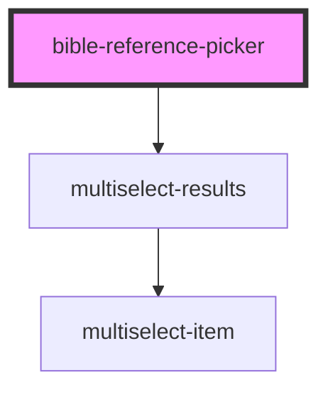

# bible-reference-picker

<!-- Auto Generated Below -->

## Properties

| Property                | Attribute                  | Description | Type     | Default |
| ----------------------- | -------------------------- | ----------- | -------- | ------- |
| `maxNumberOfReferences` | `max-number-of-references` |             | `number` | `1`     |

## Events

| Event               | Description | Type                            |
| ------------------- | ----------- | ------------------------------- |
| `referencesUpdated` |             | `CustomEvent<BibleReference[]>` |

## Dependencies

### Depends on

- [multiselect-results](../multiselect-results)

### Graph

----------------------------------------------

*Built with [StencilJS](https://stenciljs.com/)*
