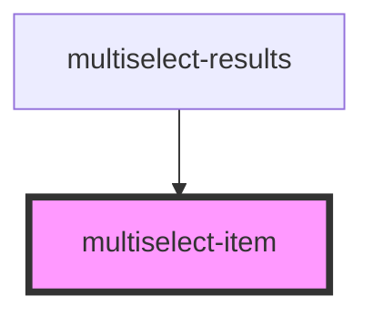

# multiselect-item

<!-- Auto Generated Below -->

## Properties

| Property        | Attribute        | Description | Type  | Default     |
| --------------- | ---------------- | ----------- | ----- | ----------- |
| `itemReference` | `item-reference` |             | `any` | `undefined` |

## Events

| Event        | Description | Type               |
| ------------ | ----------- | ------------------ |
| `removeItem` |             | `CustomEvent<any>` |

## Dependencies

### Used by

 - [multiselect-results](../multiselect-results)

### Graph

----------------------------------------------

*Built with [StencilJS](https://stenciljs.com/)*
