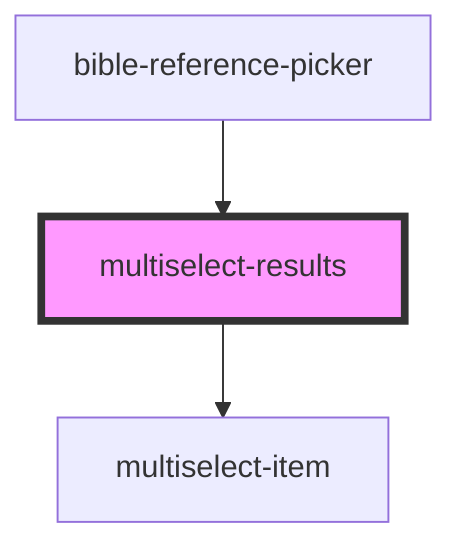

# multiselect-results

<!-- Auto Generated Below -->

## Properties

| Property            | Attribute             | Description | Type     | Default                |
| ------------------- | --------------------- | ----------- | -------- | ---------------------- |
| `compactMediaQuery` | `compact-media-query` |             | `string` | `'(max-width: 480px)'` |
| `itemLabel`         | `item-label`          |             | `string` | `'item'`               |
| `items`             | --                    |             | `any[]`  | `[]`                   |
| `labelKey`          | `label-key`           |             | `string` | `undefined`            |
| `maxInlineItems`    | `max-inline-items`    |             | `number` | `2`                    |

## Events

| Event         | Description | Type               |
| ------------- | ----------- | ------------------ |
| `itemRemoved` |             | `CustomEvent<any>` |

## Dependencies

### Used by

 - [bible-reference-picker](../bible-reference-picker)

### Depends on

- [multiselect-item](../multiselect-item)

### Graph

----------------------------------------------

*Built with [StencilJS](https://stenciljs.com/)*
